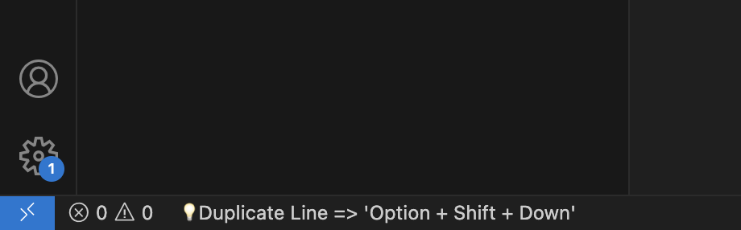

# IntelliJ Shortcut Hint

Don't remember VS Code shortcuts? Just type your familiar IntelliJ shortcuts, and this extension will show you the corresponding VS Code shortcut.

## Features

- **Non-Intrusive Hints**: Get immediate feedback without leaving your editor.
- **Cross-Platform Support**: Works for both macOS (`Cmd`) and Windows/Linux (`Ctrl`) users.
- **Core Shortcuts Covered**: Includes essential shortcuts for formatting, navigation, and code editing.

## How It Works

Simply press an IntelliJ shortcut you're used to (e.g., `Cmd+D` to duplicate a line). A small information message will pop up in the status bar, reminding you of the VS Code equivalent (e.g., `Option+Shift+Down`).

## Why Hints, Not Keybindings?

Forcefully rebinding keys can cause conflicts and may hinder full adaptation to the VS Code environment. Instead of binding, this extension gives you immediate feedback on your incorrect shortcut usage, which is a simpler and more effective way to adapt quickly.

## Supported Shortcuts

| Feature              | IntelliJ (macOS)      | IntelliJ (Win/Linux) | VS Code (macOS)         | VS Code (Win/Linux)   |
| :------------------- | :-------------------- | :------------------- | :---------------------- | :-------------------- |
| **Format Code**      | `Cmd + Option + L`    | `Ctrl + Alt + L`     | `Shift + Option + F`    | `Shift + Alt + F`     |
| **Go to Definition** | `Cmd + B`             | `Ctrl + B`           | `F12`                   | `F12`                 |
| **Find Usages**      | `Alt + F7`            | `Alt + F7`           | `Shift + F12`           | `Shift + F12`         |
| **Rename**           | `Shift + F6`          | `Shift + F6`         | `F2`                    | `F2`                  |
| **Delete Line**      | `Cmd + Y`             | `Ctrl + Y`           | `Cmd + Shift + K`       | `Ctrl + Shift + K`    |
| **Duplicate Line**   | `Cmd + D`             | `Ctrl + D`           | `Option + Shift + Down` | `Alt + Shift + Down`  |
| **Navigate to File** | `Cmd + Shift + O`     | `Ctrl + Shift + N`   | `Cmd + P`               | `Ctrl + P`            |
| **Recent Files**     | `Cmd + E`             | `Ctrl + E`           | `Ctrl + Tab`            | `Ctrl + Tab`          |

## Resolving Keybinding Conflicts

This extension works by registering IntelliJ's shortcuts. However, these shortcuts might already be in use by VS Code or another extension.

**If a shortcut doesn't work, you likely have a conflict.** Here’s how to fix it:

1. Open the Keyboard Shortcuts editor:
    - On macOS: `Cmd + K` then `Cmd + S`
    - On Windows/Linux: `Ctrl + K` then `Ctrl + S`
2. In the search bar, type the exact shortcut that isn't working (e.g., `cmd+alt+l` on Mac).
3. You will see a list of commands assigned to that shortcut. If you see a command other than `intellijShortcutHint.checkShortcut`, it's a conflict.
4. Right-click on the conflicting command and select **Remove Keybinding** to allow this extension to work.

## Installation

1. Open **Visual Studio Code**.
2. Go to the **Extensions** view (`Cmd+Shift+X`).
3. Search for `IntelliJ Shortcut Hint`.
4. Click **Install**.

## Contributing

Suggestions and contributions are welcome! If you have a favorite IntelliJ shortcut you'd like to see added, please feel free to open an issue or submit a pull request on the project's GitHub repository.

## License

This project is licensed under the MIT License.